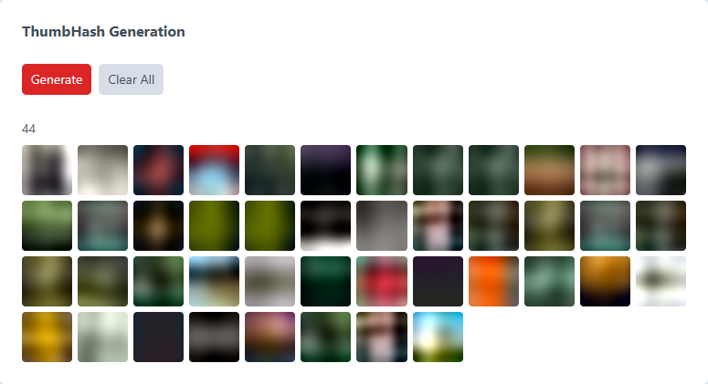

# ThumbHash for Craft CMS

Automatic thumbhash placeholder generation for Craft CMS image assets.

## What is ThumbHash?

### Frontend

ThumbHash is a compact image placeholder with two implementation approaches:

#### JS Decoder

- Inline a tiny base64 hash string (~28 bytes) in your HTML and use the included client-side JS decoder to convert it to a small PNG data URL on the fly.

#### Inline Data URLs

- For zero-JavaScript placeholders, use and inline the pre-decoded PNG data URL. No network requests or JS decoding and still smaller and better looking than most regular LQIPs.

<table>
    <tr>
        <td></td>
        <td></td>
    </tr>
</table>

Photo by <a href="https://unsplash.com/@sanjeevan_s?utm_source=unsplash&utm_medium=referral&utm_content=creditCopyText">Sanjeevan  SatheesKumar</a> on <a href="https://unsplash.com/photos/tree-surrounded-by-grass-MG8c-4n1QVE?utm_source=unsplash&utm_medium=referral&utm_content=creditCopyText">Unsplash</a>
      

### Backend
- Triggers a transform for a 100×100px thumbnail of the original image and encodes it to a compact base64 hash string (~28 bytes) using the ThumbHash algorithm.
- Decodes the hash to a PNG data URL and stores it in the database for inline use without JavaScript.
- ThumbHash generation is performed asynchronously in a queue job to avoid blocking the request thread.
- Placeholders are generated on new uploads and file replacements, with a CLI command for backfilling existing assets.

### JS Decoder vs. Inline Data URLs

- The JS decoder is very fast. On desktop-class runtimes, decoding a hash to a data URL is typically well under 1ms; mobile performance varies by device.
- The client-side decoder uses the standard ThumbHash PNG encoder in the browser. It does not apply the plugin's server-side PNG compression settings.
- When `generateDataUrl` is enabled (default), the plugin can store a compressed PNG data URL in the database for the no-JS path. That usually produces a smaller inline PNG than decoding the same hash on the client.
- The base64 hash string is around ~28 bytes, while the decoded PNG data URL is typically around ~0.8-2KB per image, depending on the image content and compression settings. Gzip/Brotli compression can further reduce the data URL size when served from your server.
- In practice, the larger client-decoded PNG usually isn't a problem: the browser is decoding from an already-inlined hash string, there is no extra network request, and the decode itself happens extremely quickly.

If your images are hosted externally and that service goes down for whatever reason, users will always get a placeholder.


## Requirements

- Craft CMS 5.0+
- PHP 8.2+

## Recommendations
- External transform service recommended for best performance (e.g. Imgix, Cloudflare Images)

## Installation

```bash
composer require craftyhedge/craft-thumbhash
php craft plugin/install thumbhash
```

## Usage

### Twig Templates

The decoder script will decode each hash to a tiny PNG data URL and set it as the `src` on the element.
For the earliest possible placeholder paint, keep the decoder script registered in the `<head>` and leave the default setting `deferDecoderScript` set to `false` so the decoder can run as soon as possible.

This is a deliberate tradeoff, not a blanket performance rule. A non-deferred script in the `<head>` can add some parser-blocking work, but it also allows placeholders to appear sooner. If you would rather minimize the impact of a head script and can accept placeholders appearing a little later, set `deferDecoderScript` to `true`.

```twig
{# Register the decoder asset (safe to call; Craft includes it once per page) #}
{{ thumbhashScript() }}
```

Your lazy loading library (lazysizes, lozad, etc.) handles swapping `data-src` → `src` when the element enters the viewport.

Note that this browser-decoded placeholder uses the standard ThumbHash PNG output, not the plugin's optional server-side PNG compression. That means the resulting data URL may be a bit larger than `thumbhashDataUrl(asset)`, but it is generated locally from the inlined hash with no additional request and is typically ready essentially immediately.

```twig
{# For each image, use data-thumbhash with your preferred lazy loading approach #}



```

### Smooth Load Transitions

Lazysizes example:

To achieve a nice smooth fade use the hash with a CSS background. 

Pass the hash directly to `data-thumbhash-bg`. The decoder will populate `style.backgroundImage` and apply the configured background placeholder styles for you. By default that is `background-repeat: no-repeat`, `background-size: cover`, and `background-position: center`.

```twig


<div class="relative z-0 w-full h-auto" data-thumbhash-bg="{{ hash }}">
    
</div>
```

For the no JS decoding option, you can use `thumbhashDataUrl()` to get the decoded PNG data URL directly and set it as an inline background image:

```twig


<div class="relative z-0 w-full h-auto" style="background-image: url('{{ placeholder }}'); background-repeat: no-repeat; background-size: cover; background-position: center;">
    
</div>
```

### CSS for Lazyloading Class Swaps

Lazysizes example:

```css
img.lazyload,
img.lazyloading {
    @apply opacity-0;
}

img.lazyloaded {
    @apply opacity-100;
    animation: lazy-image-fade-in 500ms ease-out both;
}

@keyframes lazy-image-fade-in {
    from {
        opacity: 0;
    }

    to {
        opacity: 1;
    }
}

img.lazyload:not([src]) {
    visibility: hidden;
}
```

### Template Functions

| Function | Description |
|---|---|
| `thumbhash(asset)` | Returns the base64 thumbhash string for an asset, or `null` |
| `thumbhashDataUrl(asset)` | Returns the thumbhash decoded as a PNG data URL, or `null` |
| `thumbhashScript()` | Registers the client-side decoder asset bundle |

### Control Panel

For supported image assets, the plugin also surfaces ThumbHash data in the Craft control panel:

- Asset details show a `ThumbHash` metadata field with the stored hash string.
- Asset details show a `#PNG` metadata preview when a PNG data URL is available.
- The Assets index gets a `#PNG` preview column by default when `generateDataUrl` is enabled.

### Control Panel Utility

The plugin also adds a `Utilities -> ThumbHash` screen for maintenance tasks:

- Queue generation for missing or modified image assets.
- Preview stored PNG placeholders across assets.
- Clear all stored thumbhash records.



### JavaScript API

The decoder exposes a global API for manual use:

This API mirrors the default ThumbHash browser encoder. It does not use the plugin's server-side compressed PNG generation path.

```js
// Decode a base64 thumbhash to a data URL
var dataUrl = window.thumbhash.toDataURL('BASE64_HASH');

// Or get a CSS background-image value
var backgroundImage = window.thumbhash.toBackgroundImage('BASE64_HASH');
```


## Configuration

Create `config/thumbhash.php` in your Craft project to limit generation by volume handle:

```php
<?php

return [
    // Default: all volumes
    'volumes' => '*',

    // Or restrict generation to specific volumes
    // 'volumes' => ['images', 'hero'],

    // Generate and store the base64 thumbhash string (~28 bytes per asset).
    // Used with the client-side JS decoder. Default: true
    // 'generateHash' => true,

    // Generate and store the decoded PNG data URL (typically ~0.8-2KB per asset).
    // Used for inline placeholders without JavaScript. Set to false to disable PNG creation.
    // Default: true
    // 'generateDataUrl' => true,

    // Use PNG compression for generated data URLs.
    // If false, uses the standard uncompressed ThumbHash PNG encoder.
    // Default: true
    // 'pngCompressionEnabled' => true,

    // PNG compression level for generated data URLs (0-9).
    // Higher values reduce size but are slower to encode.
    // Default: 9
    // 'pngCompressionLevel' => 9,

    // Strip metadata from Imagick-generated PNGs.
    // Ignored when Imagick is unavailable.
    // Default: true
    // 'pngStripMetadata' => true,

    // Transform definition used as the source image for hash generation.
    // Default: fit 100x100
    // 'sourceTransform' => [
    //     'mode' => 'fit',
    //     'width' => 100,
    //     'height' => 100,
    // ],

    // CSS styles applied automatically when using `data-thumbhash-bg`.
    // Set to an empty array to disable the auto-applied background styles.
    // Default: no-repeat / cover / center
    // 'backgroundPlaceholderStyles' => [
    //     'backgroundRepeat' => 'no-repeat',
    //     'backgroundSize' => 'cover',
    //     'backgroundPosition' => 'center',
    // ],

    // Load the frontend ThumbHash decoder script with the defer attribute.
    // Set to false to keep the script non-deferred.
    // Default: false
    // 'deferDecoderScript' => false,

    // Include debug-level plugin logs when dev mode is enabled.
    // Default: false
    // 'logDebug' => false,
];
```

### Transform Source

For the best server performance, it is recommended to use an external transform service like Imgix or Cloudflare Images.

If your project is setup to replace the native Craft transforms with an external service, ThumbHash will also use that meaning the largest part of the thumbhash generation process is offloaded to the external service. This is ideal since those services are optimized for fast transform generation and delivery.

#### Imgixer

[Imgixer](https://github.com/croxton/imgixer/) is a Craft plugin that provides an Imgix transform source. If you're using Imgixer, you can configure it as the transform source for ThumbHash.

If you are using Imgixer for Craft transforms, configure an Imgix source in `config/imgixer.php` and point Imgixer's transform source to it:

```php
<?php

use craft\helpers\App;

return [
    'sources' => [
        'imgix' => [
            'provider' => 'imgix',
            'endpoint' => App::env('IMGIX_DOMAIN'),
            'privateKey' => App::env('IMGIX_KEY'),
            'signed' => true,
            'defaultParams' => ['auto' => 'compress,format'],
        ],
        'assetTransforms' => [
            'provider' => 'imgix',
            'endpoint' => App::env('IMGIX_DOMAIN'),
            'privateKey' => App::env('IMGIX_KEY'),
            'signed' => true,
            'defaultParams' => ['auto' => 'compress,format'],
        ],
    ],
    'transformSource' => 'assetTransforms',
];
```

#### Cloudflare Images
There are a few options for Cloudflare Images integration, depending on your needs:
- Cloudflare Images: deuxhuithuit/craft-cloudflare-images
- Cloudflare Transformations: lenvanessen/cloudflare-image-transforms

#### Other Transform Services
There may be more options and how you set these up is up to you.

Whatever transforms service is in use for your project, Thumbhash will use. You can double check the ThumbHash logs to check what URL is being used as the source for hash generation.

## Backfilling Existing Assets

To generate thumbhashes for assets that existed before the plugin was installed:

```bash
# All image assets
php craft thumbhash/generate

# Specific volume only
php craft thumbhash/generate --volume=images
```

This command queues a batch job and returns immediately with the queued job ID. Processing starts when your Craft queue runner picks up the job.

## Clearing Stored Thumbhashes

From the Control Panel Utility:

- Open Utilities → ThumbHash
- Click `Clear All`
- Confirm the prompt to delete all stored thumbhash records

From CLI:

```bash
php craft thumbhash/generate/clear --yes=1

# Clear only stored PNG data URLs, keep thumbhash strings
php craft thumbhash/generate/clear-data-urls --yes=1
```

The `--yes=1` flag is required as a safety guard for this destructive action.

## Notes

- **SVGs are skipped** — they can't be rasterized to pixels for hashing
- **Animated GIFs** — only the first frame is hashed
- **Imagick is preferred** over GD for proper 8-bit alpha channel support
- Hashes and png urls are stored in a custom `thumbhashes` DB table with a foreign key cascade to the elements table

## Logging

This plugin registers its own log target and writes to:

- `storage/logs/thumbhash-YYYY-MM-DD.log`

Notes:

- In dev mode, info/warning/error messages are logged by default.
- Set `logDebug` to `true` in `config/thumbhash.php` to include debug-level plugin events in dev mode.
- In non-dev mode, warning/error messages are logged.

## License

The Craft License — see [LICENSE.md](LICENSE.md).

The client-side decoder includes code from [evanw/thumbhash](https://github.com/evanw/thumbhash) (MIT License).
